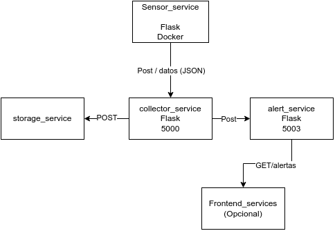

# city_monitor_microservises
# 🛰️ Proyecto: Sistema Distribuido para Monitoreo Ambiental

**Autores:** Andrés Mateo Dorantes, José Abraham Marín Sánchez, Luis Antonio Salinas Mata  
**Fecha:** 27/06/2025  
**UEA:** Sistemas Distribuidos  

## 🎯 Objetivo

Desarrollar un sistema distribuido que monitoree variables ambientales (temperatura, humedad y calidad del aire) en distintos barrios mediante una arquitectura de microservicios.  
La solución está construida con **Python**, **Flask**, **Docker**, y comunica los servicios por **HTTP REST** usando **JSON**.

---

## 🧩 Arquitectura de Microservicios

El sistema está compuesto por los siguientes servicios:

- `sensor_service`: simula sensores y envía datos periódicamente.
- `collector_service`: recibe y redirige los datos a los servicios correspondientes.
- `storage_service`: guarda mediciones por barrio y expone una API de consulta.
- `alert_service`: evalúa los datos y genera alertas por valores extremos.
- `frontend_service` (opcional): interfaz web para consultar datos y alertas.

📌 Diagrama de arquitectura:  
 <!-- Asegúrate de subir la imagen al repo -->

---

## 🛠️ Tecnologías Usadas

- Lenguaje: Python 3.10+
- Framework: Flask
- Comunicación: HTTP REST (`requests`)
- Contenedores: Docker y Docker Compose
- Formato de datos: JSON

---

## 🚨 Generación de Alertas

Las alertas se generan cuando:

- Temperatura > 35 °C  
- Humedad < 20% o > 80%  
- Calidad del aire > 60

Ejemplo de salida:

---

## 📡 API de Consulta (`storage_service`)

| Método | Ruta                        | Descripción                            |
|--------|-----------------------------|----------------------------------------|
| GET    | `/barrio/<nombre>`          | Últimas mediciones del barrio          |
| GET    | `/promedio/<nombre>`        | Promedios de temperatura, humedad, aire|
| GET    | `/todos` *(opcional)*       | Todas las mediciones almacenadas       |

---

## 🚀 Ejecución rápida

1. Clona el repositorio:
```bash
git clone https://github.com/Finot23/city_monitor_microservises
cd city_monitor_microservises
```
2. Ahora levanta los servicios en Docker
```bash
docker-compose up --build
```
3. Visualiza las alertas en consola y consulta los endpoints con Postman o navegador.


La solución propuesta permite simular un sistema distribuido funcional, modular y escalable. Se puede extender fácilmente para soportar nuevos barrios, almacenamiento persistente y visualización en tiempo real. Docker permite levantar todo el ecosistema rápidamente, ideal para entornos de desarrollo y pruebas.

